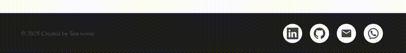

# **GG-footer**

Um componente de rodapé simples, elegante e fácil de usar.  
Inclui ícones para WhatsApp, Gmail e LinkedIn, totalmente estilizados e responsivos. Ideal para qualquer projeto React.

## Instalação

npm install gg-footer
 
## Uso


```
import GGFooter from "gg-footer";

function App() {
  return (
    <div>
      <GGFooter
        whatsapp="5511999999999"
        gmail="seuemail@gmail.com"
        linkedin="https://www.linkedin.com/in/seuusuario/"
        owner="Seu Nome Aqui"
      />
    </div>
  );
}

expexport default App
```
## Props

| Prop       | Tipo   | Descrição |
|------------|--------|-----------|
| nome       | string | Nome exibido no rodapé |
| whatsapp   | string | Link do WhatsApp |
| github     | string | Link do GitHub |
| gmail      | string | Email (mailto) |
| linkedin   | string | Perfil LinkedIn |


## ## Demo


